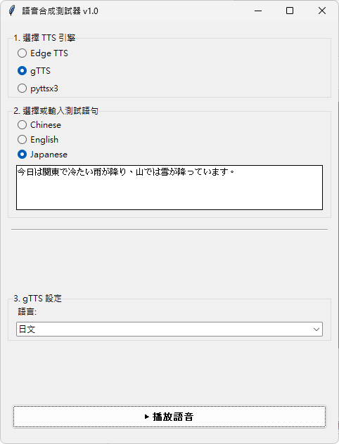

# Python TTS GUI Tool

A user-friendly desktop application for testing and comparing different Text-to-Speech (TTS) engines, including Microsoft Edge TTS, Google Translate TTS (gTTS), and the offline engine pyttsx3.

This tool provides a graphical user interface (GUI) to easily select languages, accents, and voices, and it plays the synthesized audio directly from memory to avoid file-access errors.

## Features

-   **Multiple Engine Support**: Seamlessly switch between `Edge TTS`, `gTTS`, and `pyttsx3`.
-   **Dynamic Voice Loading**: Automatically fetches the latest available voices for Edge TTS.
-   **Intuitive Voice Selection**: A cascading dropdown menu system to filter Edge TTS voices by Language -> Region/Accent -> Gender -> Voice.
-   **In-Memory Playback**: Audio is generated and played directly from RAM, preventing disk write/read errors and improving performance.
-   **Cross-Platform**: Built with Tkinter and Pygame, making it compatible with Windows, macOS, and Linux.
-   **User-Friendly Interface**: Simple and clean UI for easy testing and comparison.

## Screenshot



## Installation

To run this application, you need Python 3 installed on your system.

**1. Clone the repository (or download the files):**

If you are using Git, clone the repository:
```bash
git clone https://github.com/StephenwwW/Python-TTS-GUI-Tool.git
cd Python-TTS-GUI-Tool
